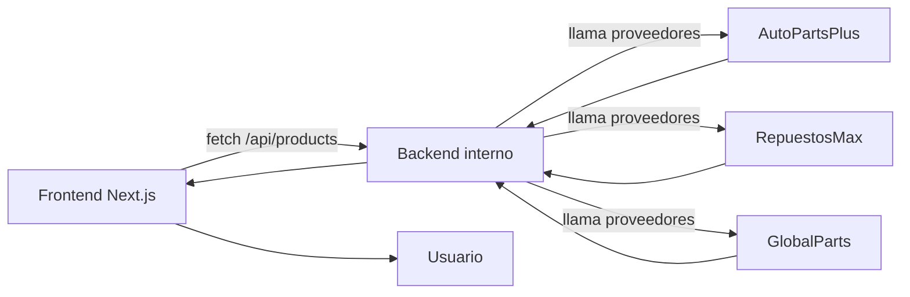

# 🚗 Turboshop Marketplace – Prueba Técnica

Marketplace de repuestos en tiempo real con backend unificado y frontend en Next.js.

## ✨ Descripción General

Este proyecto implementa un **marketplace de repuestos automotrices** que unifica el catálogo de tres proveedores externos:

- **AutoPartsPlus**
- **RepuestosMax**
- **GlobalParts**

Cada proveedor expone APIs con **esquemas distintos**, **latencias variables** y **fallos intermitentes**.  
El objetivo es construir una arquitectura robusta que:

- Unifique todos los formatos en un **contrato propio estable**.
- Exponga un **backend interno** accesible desde el frontend.
- Entregue búsqueda, filtros y actualizaciones automáticas.
- Soporte fallos parciales sin interrumpir el catálogo.
- Entregue una vista de detalle y un listado de productos similares.

---

## 🧱 Stack Tecnológico

| Capa | Tecnología |
|------|------------|
| **Frontend** | Next.js 16 (App Router), React 19, TailwindCSS |
| **Backend interno** | Next.js API Routes |
| **Normalización** | TypeScript + adaptadores |
| **Live updates** | Polling (15s) |
| **Despliegue** | Vercel / Railway |

---

## 🔌 Endpoints internos

### 📌 GET `/api/products`
Parámetros:  
`page`, `limit`, `search`, `brand`, `model`, `yearFrom`, `yearTo`

Retorna catálogo normalizado.

### 📌 GET `/api/products/[sku]`
Retorna detalle consolidado + ofertas por proveedor.

---

## 🧠 Normalización

```ts
type ProductSummary = {
  sku: string;
  name: string;
  brand: string;
  model?: string;
  yearFrom?: number;
  yearTo?: number;
  thumbnailUrl?: string;
  offers: Offer[];
};
```

### 🔄 Merge por SKU

```ts
if (!existing) {
  merged.set(sku, product);
} else {
  merged.set(sku, {
    ...existing,
    offers: [...existing.offers, ...product.offers],
  });
}
```

### ✔️ Manejo de fallos parciales

Se usa `Promise.allSettled()` para que un proveedor caído no afecte al catálogo.

---

## 🖥️ Instalación y ejecución

### 1. Clonar

```bash
git clone https://github.com/TU-USUARIO/turboshop-marketplace.git
cd turboshop-marketplace
```

### 2. Instalar dependencias

```bash
npm install
```

### 3. Variables de entorno

Crear `.env.local`:

```ini
PROVIDERS_BASE_URL=https://web-production-84144.up.railway.app
```

### 4. Ejecutar en desarrollo

```bash
npm run dev
```

---

## 🗂️ Estructura

```bash
/src
 ├── app
 │   ├── api/products
 │   │        ├── route.ts
 │   │        └── [sku]/route.ts
 │   ├── page.tsx
 │   └── product/[sku]/page.tsx
 ├── lib/providers
 ├── lib/types.ts
 └── styles / components...
```

---

## 🎨 UI/UX

- Catálogo completo en una sola vista  
- Detalle por SKU  
- Productos similares  
- Dark mode  
- Filtros rápidos  
- Miniaturas en tabla  
- Actualización automática  

---

## 🧭 Arquitectura



---

## 🚀 Deploy

- Vercel / Railway  
- Hacer push al repo  
- Configurar `PROVIDERS_BASE_URL`  
- Deploy automático

---

## ✅ Estado Final

- Catálogo unificado sin paginación  
- Vista de detalle con ofertas  
- Productos similares  
- Backend robusto ante fallos  
- Normalización consistente  
- UI limpia, responsiva y actualizada automáticamente  
