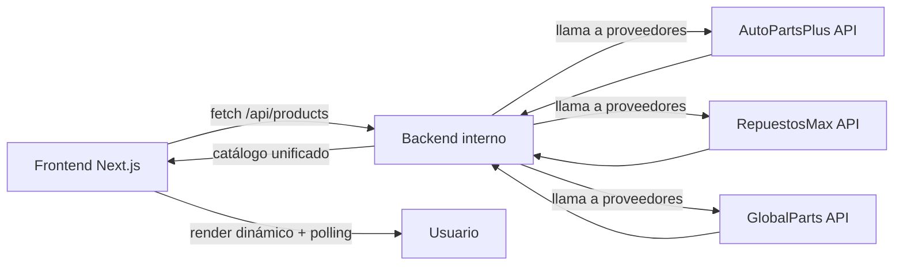

# 🚗 Turboshop Marketplace – Prueba Técnica

Marketplace de repuestos en tiempo real con backend unificado y frontend en Next.js.

## ✨ Descripción General

Este proyecto implementa un **marketplace de repuestos automotrices** que unifica el catálogo de tres proveedores externos:

- **AutoPartsPlus**
- **RepuestosMax**
- **GlobalParts**

Cada proveedor expone APIs con **esquemas distintos**, **latencias variables** y **fallos intermitentes**.
El objetivo fue construir una arquitectura robusta que:

- Unifique todos los formatos en un **contrato propio estable**.
- Exponga un **backend interno** accesible desde el frontend.
- Entregue al usuario búsqueda, filtros, paginación y actualización automática en tiempo real.
- Soporte fallos parciales sin interrumpir la consulta del catálogo.

## 🧱 Stack Tecnológico

| Capa | Tecnología |
|------|------------|
| **Frontend** | Next.js 16 (App Router), React 19, TailwindCSS |
| **Backend interno** | Next.js API Routes |
| **Normalización de datos** | TypeScript + adaptadores por proveedor |
| **Actualización en tiempo real** | Polling inteligente (15s) |
| **Despliegue recomendado** | Railway / Vercel |

## 🗂️ Estructura del proyecto

```
/src
 ├── app
 │   ├── api
 │   │   └── products
 │   │        ├── route.ts          ← catálogo unificado + filtros
 │   │        └── [sku]/route.ts    ← detalle de producto unificado
 │   ├── product/[sku]/page.tsx     ← vista de detalle
 │   └── page.tsx                   ← catálogo con filtros + polling
 │
 ├── lib
 │   ├── types.ts                   ← contrato unificado: ProductSummary
 │   └── providers
 │        ├── index.ts              ← merge + filtros + normalización
 │        ├── autopartsplus.ts
 │        ├── repuestosmax.ts
 │        └── globalparts.ts
 │
 └── styles / components...
```

## ⚙️ Instalación y ejecución

### 1. Clonar el repositorio
```bash
git clone https://github.com/tu-usuario/turboshop-marketplace.git
cd turboshop-marketplace
```

### 2. Instalar dependencias
```bash
npm install
```

### 3. Variables de entorno  
Crear un archivo **.env.local** con:

```
PROVIDERS_BASE_URL=URL.app
```

### 4. Ejecutar en modo desarrollo
```bash
npm run dev
```

### 5. Abrir en navegador
```
http://localhost:3000
```

## 🔌 Backend interno – Endpoints normalizados

### 📌 GET `/api/products?page=1&limit=12&search=&brand=&model=&yearFrom=&yearTo=`

```json
{
  "data": [
    {
      "sku": "CO-MIQKH2RE",
      "name": "Inyector Delantero",
      "brand": "Gates",
      "model": "Combustible",
      "yearFrom": 2013,
      "yearTo": 2014,
      "thumbnailUrl": "...",
      "offers": [
        {
          "provider": "autopartsplus",
          "price": 45968,
          "currency": "CLP",
          "stock": 26,
          "lastUpdated": "2025-12-08T18:24:58.082Z"
        }
      ]
    }
  ],
  "page": 1,
  "limit": 12
}
```

### 📌 GET `/api/products/[sku]`

```json
{
  "sku": "CO-MIQKH2RE",
  "name": "Inyector Delantero",
  "brand": "Gates",
  "offers": [...]
}
```

## 🧠 Lógica de normalización

### ✔️ Adaptadores por proveedor

```ts
type ProductSummary = {
  sku: string;
  name: string;
  brand: string;
  model?: string;
  yearFrom?: number;
  yearTo?: number;
  thumbnailUrl?: string;
  offers: Offer[];
};
```

### ✔️ Merge inteligente por SKU

```ts
if (!existing) merged.set(sku, product);
else merged.set(sku, {
  ...existing,
  offers: [...existing.offers, ...p.offers]
});
```

### ✔️ Soporte a fallos parciales

```ts
Promise.allSettled([...]);
```

## 🔄 Actualización automática

```tsx
useEffect(() => {
  load();
  const id = setInterval(load, 15000);
  return () => clearInterval(id);
}, [page, filters]);
```

## 🎨 UI/UX

- Catálogo con tabla y miniaturas  
- Búsqueda por texto  
- Filtros avanzados  
- Paginación  
- Vista de detalle con todas las ofertas  
- Indicador de actualización automática  
- Dark mode  

## 🧭 Arquitectura



## 🚀 Deploy en Railway

1. Push al repo  
2. Crear servicio  
3. Setear `PROVIDERS_BASE_URL`  
4. Deploy automático  

## ✅ Estado actual

- Catálogo unificado funcionando  
- Detalle por SKU  
- Filtros avanzados  
- Polling 15s  
- Manejo de fallos  
- Normalización robusta  
